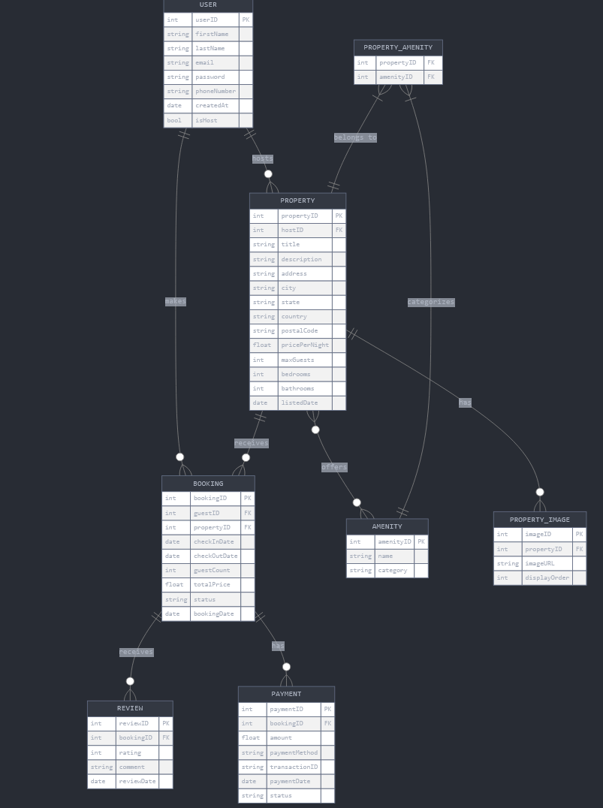

# ER Diagram for Vacation Rental System

This diagram models a vacation rental platform with core entities: **USER**, **PROPERTY**, **BOOKING**, and **REVIEW**. Users can host multiple properties and make bookings. Properties can have amenities (many-to-many) and multiple images. Each booking can have multiple reviews and payments. This structure effectively manages users, properties, bookings, reviews, and payments.

